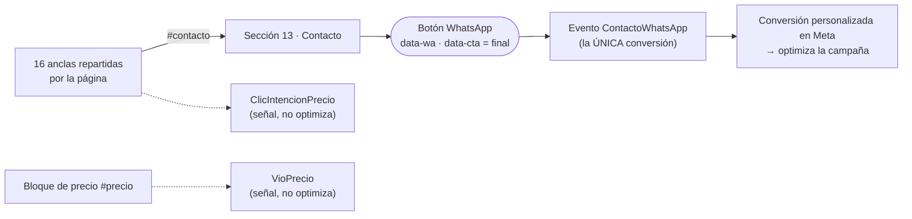

# Botón único de WhatsApp · Hacienda Primavera

Toda la página converge en **un solo punto medible**: el botón «Escribir por WhatsApp» de la sección 13 · Contacto (`#contacto`). Es el único elemento de la página que abre WhatsApp. Los demás botones son anclas que llevan hasta él.

Usa los mismos nombres de evento y de parámetro que Alto de Yeguas para poder comparar landings, con las diferencias del §9.



Reglas:

1. **Un solo evento de conversión** (`ContactoWhatsApp`) y **un solo punto de salida** a WhatsApp.
2. **Todo lo demás son anclas** `<a href="#contacto" data-cta="…">`: nunca abren WhatsApp y cada una lleva un `data-cta` único.
3. Lo previo a la conversión es **señal** (`ClicIntencionPrecio`, `VioPrecio`): sirve para diagnóstico y retargeting, no para optimizar.

## 1. Mapa de botones

Se genera con `python3 tools/check_trazabilidad.py`. Todas las anclas son `href="#contacto"`.

| `data-cta` | Dónde está | Texto |
|---|---|---|
| `nav` | Cabecera | Asesoría |
| `menu-contacto` | Menú móvil (lista) | 13 Contacto |
| `menu` | Menú móvil (botón inferior) | Hablar con un asesor |
| `hero` | Portada | Hablar con un asesor |
| `precio-plan` | 01 · Inversión, tarjeta de precio | Solicitar plan de pagos |
| `precio-visita` | 01 · Inversión, tarjeta de precio | Agendar visita al proyecto |
| `exterior` | 03 · Desde el exterior | Escríbenos desde cualquier país |
| `modelo-tulipan` `modelo-ilan` `modelo-arrayan` `modelo-urapan` `modelo-saman` | 05 · Viviendas, uno por modelo | Cotizar *(modelo)* |
| `preguntas` | 10 · Preguntas frecuentes | Hacer otra pregunta |
| `lotes` | 12 · Lotes | Consultar lotes disponibles |
| `footer` | Pie de página | Contacto |
| `flotante` | Botón flotante «¿Hablamos?» (se oculta cuando el contacto o el pie están a la vista) | ¿Hablamos? |
| **`final`** | **13 · Contacto — el único que abre WhatsApp** | **Escribir por WhatsApp** |

Los enlaces de navegación entre secciones (`#inversion`, `#lotes`…) no son botones de contacto y no se miden.

Al saltar a `#contacto`, la sección sube casi todo su relleno superior (`scroll-margin-top` negativo en el CSS) para que el botón de WhatsApp quede a la vista también en pantallas bajas (probado desde 500 px de alto).

## 2. El botón único

```html
<a data-wa data-cta="final" href="https://wa.me/573178927252?text=…" target="_blank" rel="noopener">Escribir por WhatsApp</a>
```

- El `href` va **completo en el HTML** y funciona aunque el JavaScript falle.
- Si la visita llega con UTM, el script le anexa el origen al mensaje: «Hola, estuve revisando la web de Hacienda Primavera y quiero más información **(fb · campaña · anuncio)**». Sin UTM el enlace queda idéntico. Los UTM se limpian (sin emojis cortados, caracteres de control ni `< > " ' \``, máx. 60 caracteres) y se guardan en la sesión.
- En la sección de contacto el botón va **solo** (no hay botón de llamada), grande y en el verde de WhatsApp (`#25D366`, texto oscuro para el contraste), en la columna derecha encima de la foto en escritorio y a todo el ancho arriba de los datos en móvil.
- La fila «WhatsApp» de los datos de contacto es solo texto. `tel:` (pie de página) y `mailto:` (datos de contacto y pie) no son WhatsApp y no se miden.
- Abrir el enlace con clic derecho o pulsación larga («abrir en pestaña nueva») no genera evento.

## 3. Eventos

| Evento | Cuándo | Parámetros | ¿Optimiza? |
|---|---|---|---|
| `PageView` | Solo al cargar y solo si el código instala el píxel (§5). Los saltos por ancla **no** suman `PageView` extra | — | No |
| `VioPrecio` | `#precio` entero en pantalla durante 1 s seguido (una vez por sesión). Pasar volando durante un salto no cuenta | `proyecto` | No |
| `ClicIntencionPrecio` | Clic en cualquiera de las 16 anclas | `proyecto`, `seccion` (= `data-cta`), `texto` | No |
| **`ContactoWhatsApp`** | Clic (o clic central) en el botón único. Máximo uno cada 2 s | `proyecto`, `boton`, `content_name`, `vio_precio`, `profundidad`, `segundos_en_pagina`, `calidad`, `clic_n`, `repetido`, y `utm_source` / `utm_campaign` / `utm_content` si hay | **Sí** |

- **Clics repetidos:** cada clic cuenta. `clic_n` es el número de clic en WhatsApp de la sesión y `repetido` es `true` desde el segundo. Para contar personas y no clics, crea la conversión personalizada con la regla `Evento = ContactoWhatsApp` **y** `repetido` distinto de `true` (a Meta los valores llegan como texto: «true» / «false»).
- Cada evento también se empuja al `dataLayer` (`vio_precio`, `cta_precio_click`, `contacto_whatsapp`) con los mismos datos. **Hoy la página no tiene GTM ni GA4**, así que el `dataLayer` solo sirve para depurar en la consola y para engancharlos después.

## 4. Calidad del lead

- `vio_precio`: se vio el precio (arriba).
- `profundidad`: **% de las 12 secciones de contenido que estuvieron al menos 1,5 s seguidos en la franja central de la pantalla** (no cuentan la portada ni el contacto). Un salto por ancla pasa volando y no suma, así que no se infla porque el contacto esté al final de la página. Mide ritmo de lectura, no comprensión: un scroll pausado cuenta; una pasada rápida no.
- `segundos_en_pagina`: tiempo con la pestaña visible.
- `calidad`: **alta** = vio el precio, ≥ 40 % y ≥ 60 s · **media** = (vio el precio o ≥ 20 %) y ≥ 20 s · **baja** = el resto. Son umbrales iniciales (`CONFIG.alta` y `CONFIG.media` en el script): ajústalos con datos reales.

## 5. Instalación del píxel (pendiente: el ID)

Falta el ID del píxel de Hacienda Primavera. Hasta que se ponga, **nada llega a Meta**: los eventos solo van al `dataLayer`.

- **Opción A, desde el código:** pega el ID (solo dígitos) en `CONFIG.pixelId` del bloque `TRAZABILIDAD WHATSAPP` de `index.html`. El script instala el píxel, envía `PageView` y desactiva el `PageView` automático por cambio de hash (`disablePushState`). Sin eso, el píxel suma un `PageView` por cada salto por ancla o enlace de menú (comprobado con la librería real de Meta).
- **Opción B, desde GTM:** deja `pixelId` vacío. Los eventos usan el `fbq` que ya exista. La etiqueta del píxel debe incluir `fbq.disablePushState = true;` **antes** del `init` (puesto después no hace efecto).
- **Un mismo ID nunca va en los dos sitios**: provoca «Duplicate Pixel ID» y `PageView` de más. Si ya hay un `fbq` en la página, el código no instala otro.
- Para el paquete de producción: `python3 tools/build_publicar.py --require-pixel` se detiene si `pixelId` está vacío. Sin el flag solo avisa al final.

Después de publicar: dispara `ContactoWhatsApp` una vez en producción y crea en Events Manager la conversión personalizada (ver la regla en §3). Esa es la que optimiza la campaña. La **verificación de dominio de Meta** ya está instalada: la etiqueta `facebook-domain-verification` está en el `<head>` de `index.html` (no la borres). Se verifica en Business Manager → Configuración del negocio → Seguridad de la marca → Dominios → `haciendaprimavera.co` → Verificar.

## 6. Verificación en 5 minutos

Abre la página con `?utm_source=fb&utm_medium=paid&utm_campaign=prueba&utm_content=anuncio1`.

- [ ] `python3 tools/check_trazabilidad.py` termina en `CONTRATO OK` (también se ejecuta al armar el paquete y lo detiene si falla).
- [ ] *Meta Pixel Helper* muestra `PageView` y **un solo** píxel por ID. Al pulsar anclas y enlaces del menú **no** aparecen `PageView` nuevos.
- [ ] Al quedarte con el precio entero en pantalla 1 s, `VioPrecio` aparece **una sola vez**.
- [ ] Un clic en cualquier ancla dispara `ClicIntencionPrecio` y **no** abre WhatsApp.
- [ ] El botón «Escribir por WhatsApp» abre WhatsApp en pestaña nueva y dispara **un solo** `ContactoWhatsApp` con `boton = final`.
- [ ] El mensaje termina en `(fb · prueba · anuncio1)`.
- [ ] Consola: `document.querySelectorAll('[data-wa]').length === 1` y `dataLayer.filter(e => e.event)` muestra los eventos.

> No hagas clic en el botón de WhatsApp en producción para probar: cada clic cuenta como una conversión real. Usa un navegador con el píxel bloqueado o resta esas pruebas del reporte.

## 7. Cómo agregar un botón nuevo

- Si lleva a contactar: `<a class="btn …" href="#contacto" data-cta="nombre-unico">`.
- **Nunca** un `wa.me` suelto. El verificador detecta cualquier salida a WhatsApp (`href`, `onclick`, `whatsapp://`, `intent://`, scripts que abran WhatsApp) y las anclas con `target`; el empaquetado se detiene si el contrato se rompe.
- La página de error (`404.html`) también manda a `/#contacto` en vez de a WhatsApp.

## 8. Pendientes y decisiones abiertas

- **ID del píxel** (y GTM, GA4 o Clarity, si se quieren).
- **Aviso de cookies y de tratamiento de datos (Ley 1581):** la página no lo tiene. Conviene tenerlo antes de activar el píxel.
- **Contexto por botón:** antes cada botón mandaba un mensaje distinto (modelo, plan de pagos, visita, lote). Ahora el mensaje es único. Si se quiere conservar la intención, el botón final puede heredar el `data-cta` del último ancla pulsado.
- **Llamadas y correos** no se miden.
- `llms.txt` conserva el enlace `wa.me` como dato de contacto para asistentes de IA (no es parte de la página y no pasa por el botón medido).

## 9. Diferencias con Alto de Yeguas

- Las anclas van **directo a `#contacto`**: aquí no hay sección intermedia de proceso ni botón puente.
- **No hay un segundo botón de WhatsApp**: el flotante «¿Hablamos?» es una ancla más.
- `profundidad` mide secciones leídas a ritmo pausado y no scroll máximo (con anclas el scroll siempre llega al final).
- `seccion` de `ClicIntencionPrecio` es el `data-cta` único y no el texto visible; el texto va aparte en `texto`.
- El bloque de precio (`#precio`) está en la sección 01 y no en el destino de las anclas, por eso `VioPrecio` exige que el precio se quede 1 s en pantalla.
- Se añaden `clic_n` y `repetido` a `ContactoWhatsApp`, y el píxel se instala con `disablePushState` para que los saltos por ancla no inflen los `PageView`.
